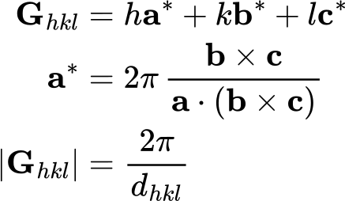
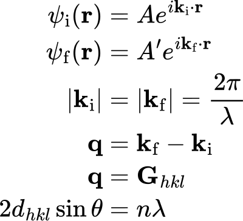
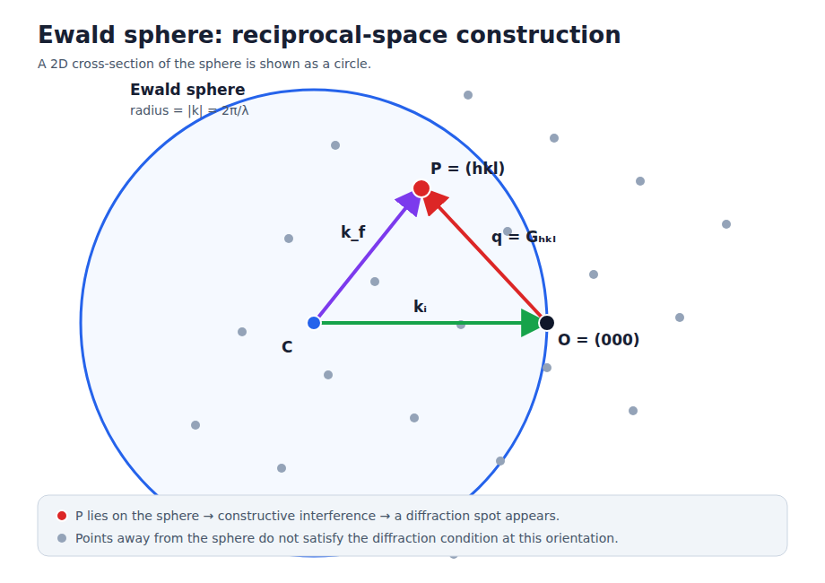
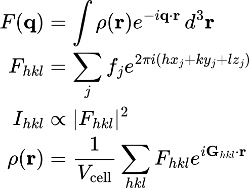

# Crystal Diffraction, Reciprocal Space, and Disorder

Crystal diffraction converts periodic structure in real space into measurable
intensity in reciprocal space. The central chain is:

**real-space scattering density → Fourier transform → reciprocal-space
amplitude → squared magnitude → diffraction intensity**.

This page connects reciprocal-lattice points, diffraction spots, wavevectors,
the Ewald sphere, structure factors, and diffuse scattering.

## Reciprocal-lattice points and diffraction spots

A crystal repeats along direct-lattice vectors **a**, **b**, and **c**. Its
reciprocal lattice is the set of vectors generated by reciprocal basis vectors.
Each reciprocal-lattice point indexed by *(hkl)* corresponds to a family of
direct-lattice planes. The reciprocal vector is normal to those planes, and its
magnitude is inversely related to their spacing.

A **reciprocal-lattice point** is a mathematical location allowed by the
crystal's translational periodicity. A **diffraction spot** is the measured
detector signal produced when one of those points satisfies the diffraction
condition. The terms are related but not interchangeable: most reciprocal
points do not produce a spot at a fixed crystal orientation.

The equation image uses the angular-wavevector convention, in which reciprocal
vectors contain a factor of 2π. Many crystallography references, including the
IUCr Online Dictionary, omit that factor: their reciprocal-vector magnitude is
1/*d* and their Ewald-sphere radius is 1/λ. Both conventions describe the same
geometry when used consistently.

## Incident and scattered wavevectors

The incident wavevector **kᵢ** specifies the propagation direction and spatial
frequency of the incoming wave. The scattered wavevector **k_f** does the same
for the outgoing wave. In elastic scattering their magnitudes are equal because
the wavelength does not change.

The scattering vector **q** is the change in wavevector. Constructive
interference from the complete crystal occurs when **q** equals a reciprocal
vector **Gₕₖₗ**. This reciprocal-space statement is the Laue condition and is
equivalent to Bragg's law.

## Ewald sphere

The Ewald sphere is a geometric test for which reciprocal-lattice points can
diffract at a chosen wavelength and crystal orientation.

In the diagram, the sphere is centred at **C** and passes through the reciprocal
origin **O**. The vector from **C** to **O** is the incident wavevector. A point
**P** on the sphere defines a scattered wavevector from **C** to **P**. The
vector from **O** to **P** is then both the scattering vector and the reciprocal
vector for that reflection. A reciprocal point on the sphere therefore
satisfies elastic-scattering geometry and the crystal diffraction condition at
the same time.

Rotating the crystal rotates its reciprocal lattice relative to the laboratory
frame. Different reciprocal points cross the sphere and different reflections
are recorded. This is why single-crystal diffraction experiments rotate the
specimen while collecting many *(hkl)* reflections.

## Fourier transform and structure factor

The Fourier transform of a scattering-density distribution gives the complex
scattering amplitude in reciprocal space. At a reciprocal-lattice point, the
unit-cell contribution is represented by the structure factor. It adds the
waves from all atoms with phases determined by their fractional coordinates and
weights determined by their atomic scattering factors.

The detector records intensity rather than the complex amplitude. Intensity is
proportional to the squared magnitude of the structure factor, so the phase is
not measured directly in an ordinary diffraction experiment. Structure
determination estimates phases, reconstructs a real-space density, builds an
atomic model, and refines that model against the observed intensities.

## Structural disorder and diffuse scattering

An ideal crystal repeats the same unit cell over long distances. Its coherent
scattering is concentrated at sharp Bragg reflections. Real crystals can depart
from perfect repetition through vacancies, substitutions, multiple molecular
orientations, correlated displacements, stacking faults, or thermal motion.

These departures redistribute part of the intensity between and around Bragg
positions. This continuous or structured intensity is **diffuse scattering**.
It can appear as clouds, streaks, sheets, or halos in reciprocal space.

- **Bragg intensity** primarily describes the periodic average structure.
- **Diffuse intensity** contains information about deviations from that average
  and about correlations between local configurations.
- **Static disorder** comes from different local arrangements frozen into the
  structure; **thermal diffuse scattering** arises from correlated atomic
  motion.

Diffuse scattering is therefore not automatically noise or merely a sign of a
poor crystal. Structured diffuse features can reveal defect correlations and
local order that an average crystallographic model does not retain.

## Common distinctions

- A reciprocal-lattice point is not a detector spot; it becomes observable only
  when the diffraction geometry and nonzero structure factor allow it.
- The Ewald sphere determines whether a reflection is geometrically accessible;
  the structure factor determines its amplitude and phase.
- A missing reflection can result from geometry, systematic absence, a very
  small structure factor, limited detector coverage, or experimental sensitivity.
- Bragg peaks and diffuse scattering are complementary measurements of average
  and local structure.

## References and further reading

- International Union of Crystallography. [Ewald sphere](https://dictionary.iucr.org/Ewald_sphere), *Online Dictionary of Crystallography*.
- International Union of Crystallography. [Reciprocal lattice](https://dictionary.iucr.org/Reciprocal_lattice), *Online Dictionary of Crystallography*.
- International Union of Crystallography. [Structure factor](https://dictionary.iucr.org/Structure_factor), *Online Dictionary of Crystallography*.
- Welberry, T. R., & Weber, T. (2016). One hundred years of diffuse scattering. *Crystallography Reviews, 22*(1), 2–78. [https://doi.org/10.1080/0889311X.2015.1046853](https://doi.org/10.1080/0889311X.2015.1046853)

## Related notes

- [Materials Science & Chemistry](index.md)
- [Powder X-ray Diffraction](powder-x-ray-diffraction.md)
- [PXRD Simulation and Rietveld Refinement](pxrd-simulation-and-refinement.md)
- [Electron Microscopy: SEM and TEM](electron-microscopy-sem-tem.md)
- [MOF Topology and Up–Down Design](mof-topology-up-down-design.md)
