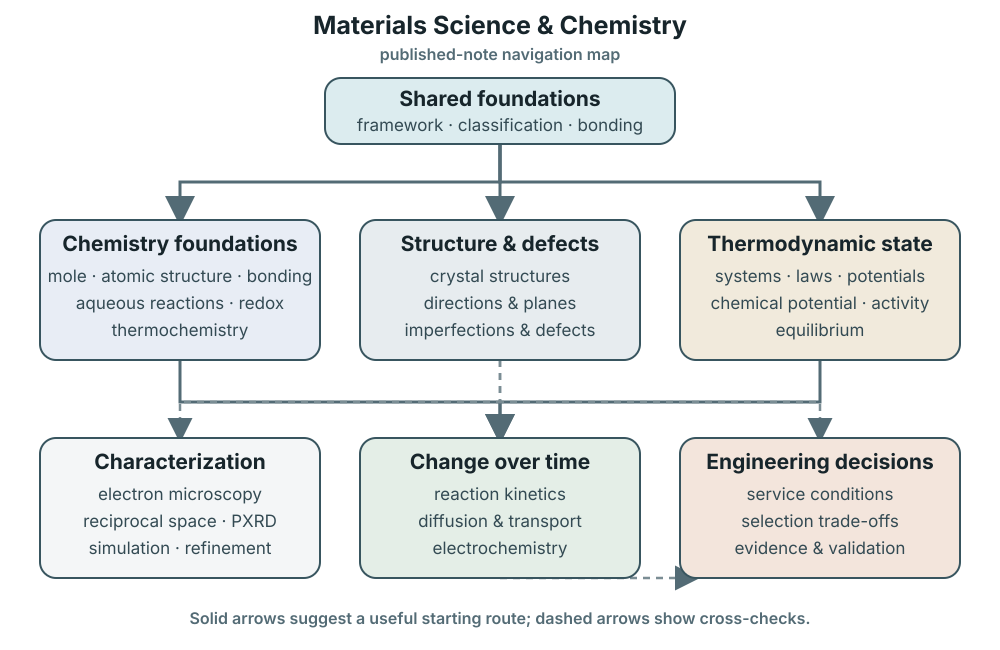

# Materials Science & Chemistry

Use this section to move from **what matter is**, through **how we measure and
change it**, to **whether a material works in practice**. Start with the shared
framework, then follow the route that matches your question.

## See the knowledge map

<figure class="concept-figure">
  <picture>
    <source media="(max-width: 719px)"
            srcset="../assets/images/materials-knowledge-map-mobile.svg">
    
  </picture>
  <figcaption>
    An orientation map of major routes, not a claim that every topic has one
    prerequisite or one physical cause. The linked list below is the complete
    catalogue of published notes.
  </figcaption>
</figure>

## Start here

1. [Materials Science and Engineering Framework](materials-science-engineering-framework.md)
   introduces the processing–structure–properties–performance map and explains
   how evidence tests each link.
2. [Materials Classification and
   Selection](materials-classification-and-selection.md) shows how broad
   families narrow a search without substituting for service conditions,
   trade-offs, processing, or verification.
3. [General Chemistry Map and Learning Path](chemistry.md) organizes
   composition, bonding, energy, and reaction concepts by prerequisite and
   connects them to that map.
4. [Chemical Language, the Mole, and
   Stoichiometry](chemical-language-mole-stoichiometry.md) connects formulae
   and balanced equations to amounts, masses, yields, and solution volumes.
5. [Atomic Structure and Periodic
   Trends](atomic-structure-periodic-trends.md) connects nuclear identity and
   electron configurations to qualified trends in atomic properties.
6. [Chemical Bonding, Molecular Structure, and Intermolecular
   Forces](chemical-bonding-molecular-structure-intermolecular-forces.md)
   connects valence electrons to bonding, molecular shape, polarity, and
   particle interactions.
7. [Atomic Structure and Interatomic Bonding in
   Materials](atomic-structure-and-interatomic-bonding.md) connects
   pair-energy models and primary or secondary interactions to qualified
   structure–property trends.
8. [Crystal Structures and Unit Cells](crystal-structures-unit-cells.md)
   connects lattices and bases to common unit cells, packing, density, and
   directional properties.
9. [Crystallographic Directions and
   Planes](crystallographic-directions-and-planes.md) turns displacements and
   plane intercepts into auditable indices without assuming a cubic metric.
10. [Imperfections and Defects in
    Solids](imperfections-and-defects-in-solids.md) classifies point, line,
    interfacial, and volume defects while separating equilibrium populations
    from processing history.
11. [Aqueous Reactions and Net Ionic
   Equations](aqueous-reactions-net-ionic-equations.md) identifies species in
   water and isolates the chemical change represented by an equation.
12. [Redox Foundations and Half-Reaction
   Balancing](redox-foundations-half-reaction-balancing.md) develops oxidation
   states, electron bookkeeping, and mass-and-charge balancing.
13. [Thermochemistry, Entropy, and Gibbs
   Energy](thermochemistry-entropy-gibbs-energy.md) connects heat and enthalpy
   to entropy, Gibbs energy, and thermodynamic direction.
14. [Thermodynamic Systems, Laws, and
    Potentials](thermodynamic-systems-laws-potentials.md) selects equilibrium
    criteria by boundary, controlled variables, composition, and work modes.
15. [Chemical Potential, Activity, and Partial Molar
    Properties](chemical-potential-activity-and-partial-molar-properties.md)
    connects composition to component-wise thermodynamic tendency and makes
    standard-state choices explicit.
16. [Unary Phase Equilibria](unary-phase-equilibria.md) connects equilibrium
    conditions, phase-rule geometry, and the Clapeyron relation to practical
    reading of one-component pressure–temperature diagrams.
17. [Binary Solutions and Phase Diagrams](binary-solutions-and-phase-diagrams.md)
    connects composition coordinates, tie lines, the lever rule, and eutectic
    cooling paths to phase amounts and equilibrium microstructure inference.
18. [Chemical Equilibrium, Acids and Bases, and
    Solubility](chemical-equilibrium-acids-bases-solubility.md) applies reaction
    quotients and equilibrium constants to coupled solution chemistry.
19. [Chemical Kinetics and Reaction
    Mechanisms](chemical-kinetics-reaction-mechanisms.md) separates reaction
    rate and pathway from thermodynamic favorability.
20. [Diffusion and Transport in
    Solids](diffusion-and-transport-in-solids.md) connects atomic jumps to flux,
    transient profiles, temperature dependence, and microstructural transport
    paths.
21. [Electrochemical Cells, Potentials, and
    Applications](electrochemical-cells-potentials-applications.md) combines
    redox, thermodynamics, equilibrium, and kinetics in cells and corrosion.
22. Choose a characterization route below when you need to determine structure,
    composition, or response experimentally.

## Characterization routes

### Images, local structure, and composition

- [Electron Microscopy: SEM and TEM](electron-microscopy-sem-tem.md) explains
  electron–matter interactions, image formation, diffraction, spectroscopy,
  preparation artifacts, and when to choose each instrument.

### Crystal and phase structure

- [Crystal Diffraction, Reciprocal Space, and Disorder](crystal-diffraction-reciprocal-space.md)
  builds the geometric and Fourier picture behind diffraction.
- [Powder X-ray Diffraction](powder-x-ray-diffraction.md) explains what peak
  position, intensity, and width can—and cannot—tell us.
- [PXRD Simulation and Rietveld Refinement](pxrd-simulation-and-refinement.md)
  separates ideal reflections, profile simulation, and whole-pattern fitting.

### Practical powder X-ray diffraction (PXRD) tools

- [Computing PXRD Patterns with pymatgen](pymatgen-pxrd.md) gives a reproducible
  Python workflow and validation checks.
- [Choosing PXRD Software](pxrd-software-selection.md) compares software roles,
  access models, and limitations.

## Applied case study

- [MOF Topology and Up–Down Design](mof-topology-up-down-design.md) shows how
  topology, building-unit orientation, and linker geometry guide the search for
  new zirconium-based metal–organic frameworks.

## What is coming next

The ten-cluster chemistry foundation above is complete in this repository
checkout. Broader chemistry coverage can still add states of matter, solution
properties, descriptive inorganic chemistry, introductory organic and nuclear
chemistry, synthesis, and analytical measurement.

The next materials-science foundations include multicomponent phase equilibria,
structure–property relations, degradation, processing, and later
lifecycle-aware selection. The links above describe repository availability;
they do not assert that an external public deployment already contains every
page.
